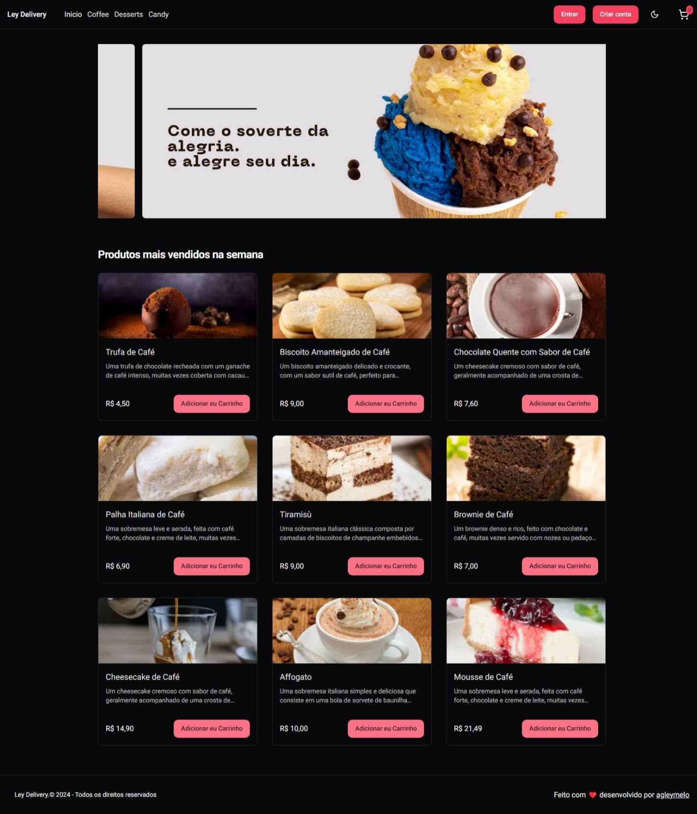
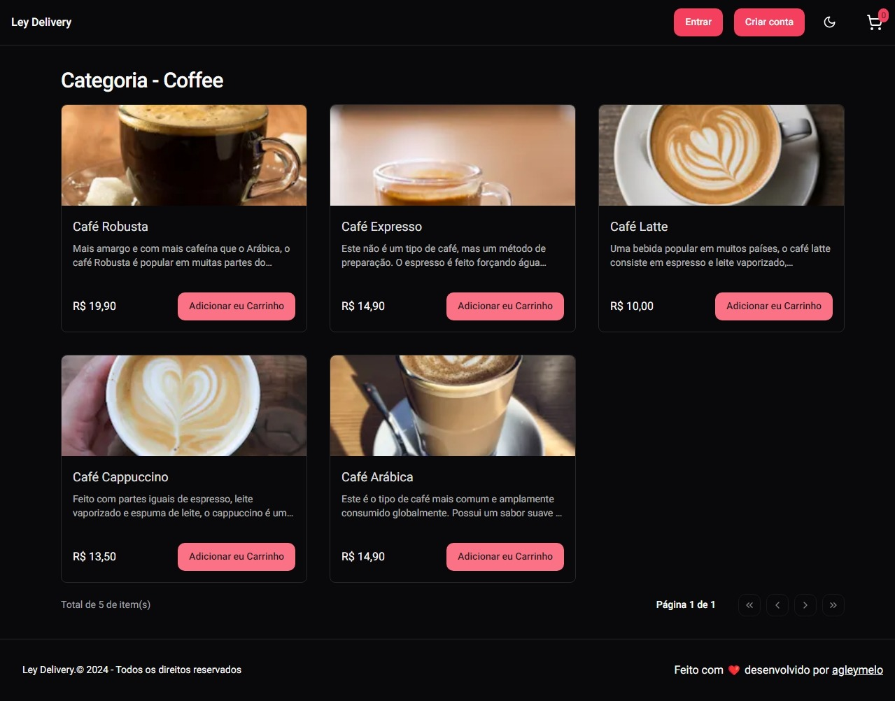

# Ley Delivery Web

Ley Delivery Web is an online platform where users can place orders for their favorite products, view their order history, track orders, and more. This project utilizes the power of [Bun](https://bun.sh/) for server-side rendering and [Shadcn/UI](https://ui.shadcn.com/), [Tailwind CSS](https://tailwindcss.com/), and [Next.js](https://nextjs.org/) (version 14) for building interactive and responsive user interfaces.

## Features

- **Order Placement**: Users can easily browse through available products and place orders for the ones they like.

- **Order History**: Users have access to their order history, allowing them to track previous purchases.

- **User Authentication**: Secure authentication system ensures that only authorized users can access the platform.

- **Responsive Design:** The web application is designed to be responsive, providing a seamless experience across devices of all sizes.

## Technologies Used

- **[Bun](https://bun.sh/)**: A server-side rendering framework that enhances the performance and SEO-friendliness of the web application.

- **[Shadcn/UI](https://ui.shadcn.com/)**: A UI component library that simplifies the process of building beautiful and functional user interfaces.

- **[Tailwind CSS](https://tailwindcss.com/)**: A utility-first CSS framework that enables rapid UI development with minimal custom styling.

- **[Next.js](https://nextjs.org/)**: A React framework that offers features like server-side rendering, static site generation, and routing out of the box.

## Live Demo

Here is a demo version for you to test the application, feel free to make changes, as they are all reverted soon after.

website: https://ley-delivery-web.vercel.app/

## Prints 

<!-- <div style="display: flex; flex-direction: row; gap: 8px;" >
  

</div> -->

## Isntallation

To get started with Ley Delivery web, follow next steps:

1. Clone this repository:
```bash
git clone https://github.com/agleymelo/ley-delivery-web
```
2. Navigate to the project directory:
```bash
cd ley-delivery-web
```
3. Install dependencies:
```bash
bun install
```
4. Open your browser and visit `http://localhost:3000` to view the applicaiton. 


## Configuration

Before running the application, you need to set up the following environment variables:

- NEXT_BACKEND_ENDPOINT: The base URL of the API endpoint for fetching product data and managing orders.

Example: 
```env
NEXT_BACKEND_ENDPOINT="https://your-api.com"
```

You can set threse environment variables either by create a `.env.local` file in the root directory of the proejct or by directly settings them in your hosting environment.

Example:

```bash
cp .env.example .env.local
```